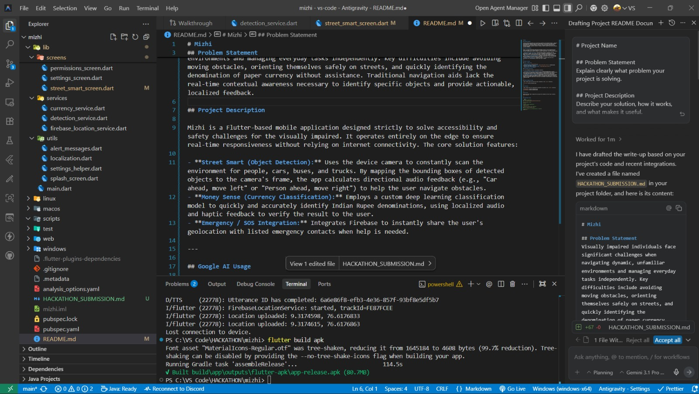
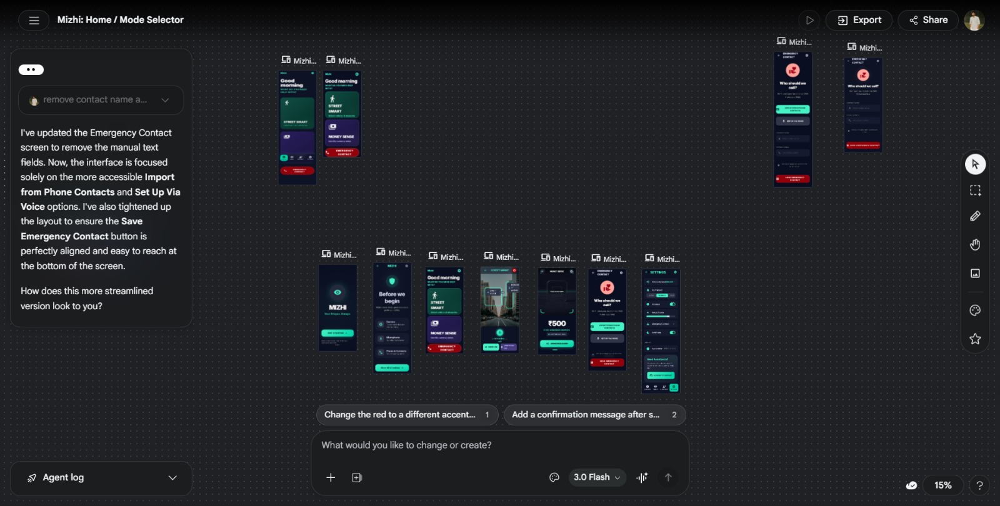

# Mizhi

## Problem Statement

Visually impaired individuals face significant challenges when navigating dynamic, unfamiliar environments and managing everyday tasks independently. Key difficulties include avoiding moving obstacles, orienting themselves safely on streets, and quickly identifying the denomination of paper currency without assistance. Traditional navigation aids lack the real-time contextual awareness necessary to identify specific objects and provide actionable, localized feedback.

## Project Description

Mizhi is an AI-powered mobile application built in Flutter designed strictly to solve accessibility and safety challenges for the visually impaired. It operates entirely on the edge to ensure real-time responsiveness without relying on internet connectivity. The core solution features:

- **Street Smart (Object Detection):** Uses the device camera to constantly scan the environment for people, cars, buses, and trucks. By mapping the bounding boxes of detected objects to the camera's frame, the app calculates directional audio feedback (e.g., "Car ahead, move left" or "Person ahead, move right") to help the user navigate obstacles.
- **Money Sense (Currency Classification):** Employs a custom deep learning classification model to quickly and accurately identify Indian Rupee denominations, using localized audio and haptic feedback to verify the result to the user.
- **Emergency / SOS Integration:** Integrates Firebase to instantly share the user's geolocation with listed emergency contacts when help is needed.

---

## Google AI Usage

### Tools / Models Used

- **Antigravity IDE**
- **Stitch AI**
- **Firebase for backend GPS**
- **Google TTS**

### How Google AI Was Used

AI is the foundation of Mizhi's accessibility features:

1. **Antigravity IDE:** Used as a core development environment to accelerate implementation and integration across the app modules.
2. **Stitch AI:** Used to support AI-assisted development workflows and improve feature iteration speed.
3. **Firebase for backend GPS:** Used to handle backend connectivity for location-based emergency/SOS GPS sharing.
4. **Google TTS:** Used to provide clear voice guidance and spoken feedback for navigation and currency detection.

---

## Proof of Google AI Usage





---

## Screenshots


.jpeg)  
.jpeg)
.jpeg)
.jpeg)
.jpeg)

---

## Demo Video

[Watch Demo](https://drive.google.com/file/d/1-6D6lfRF0qBgdeorD8Up-osKMurLOk-x/view?usp=drivesdk)

---

## Installation Steps

```bash
# Clone the repository
git clone https://github.com/sarin-ms/mizhi.git

# Go to project folder
cd mizhi

# Install Flutter dependencies
flutter pub get

# Generate Launcher Icons (Optional)
dart run flutter_launcher_icons

# Run the project on an attached device or emulator
flutter run
```
